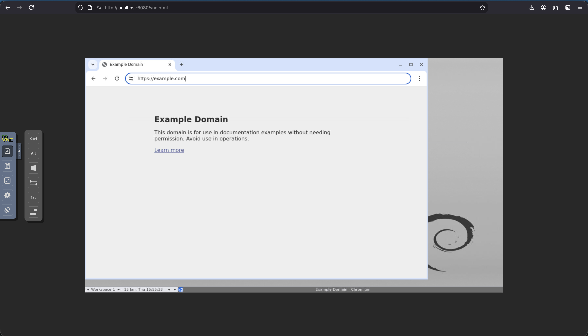

# browser-sandbox

A Docker container running [Playwright MCP](https://github.com/microsoft/playwright-mcp) server with a browser you can watch via VNC. Perfect for AI tools like Claude Code to control a visible browser in an isolated environment.



## Features

- Let agents (like claude code) control a browser for automation
- Access and control browser via noVNC to help claude when it is stuck (eg, for logins and captchas)
- Runs in isolated Docker container for security and semless setup
- Mount a volume to keep browser data across sessions

## Quick Start

### Using Docker Hub

```bash
docker run -d \
  --name browser-sandbox \
  -p 8931:8931 \
  -p 6080:6080 \
  pranavgade20/browser-sandbox
```

### Building Locally
Clone this repo:
```bash
git clone https://github.com/pranavgade20/browser-sandbox.git
cd browser-sandbox
```

```bash
docker build -t browser-sandbox .
docker run -d \
  --name browser-sandbox \
  -p 8931:8931 \
  -p 6080:6080 \
  browser-sandbox
```

### Usage

| Service | URL |
|---------|-----|
| MCP Server | http://localhost:8931/mcp |
| Browser Preview | http://localhost:6080/vnc.html |

## Connecting Claude Code

```bash
claude mcp add playwright --transport http --url http://localhost:8931/mcp
```

## Persistent Browser Data

Mount a volume to `/data` to persist browser data (cookies, localStorage, history, etc.) across container restarts:

```bash
docker run -d \
  --name browser-sandbox \
  -p 8931:8931 \
  -p 6080:6080 \
  -v browser-sandbox-data:/data \
  pranavgade20/browser-sandbox
```

Or use a local directory:

```bash
docker run -d \
  --name browser-sandbox \
  -p 8931:8931 \
  -p 6080:6080 \
  -v ~/browser-sandbox-data:/data \
  pranavgade20/browser-sandbox
```

## How It Works

The container runs:
1. **Xvfb** - Virtual framebuffer for headless display
2. **Fluxbox** - Lightweight window manager
3. **x11vnc** - VNC server exposing the display
4. **noVNC** - Web-based VNC client
5. **Playwright MCP** - Browser automation server

## License

MIT
